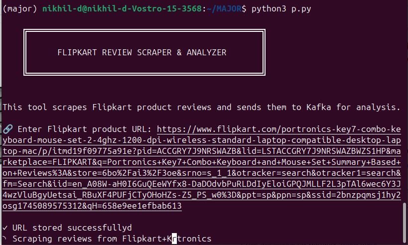
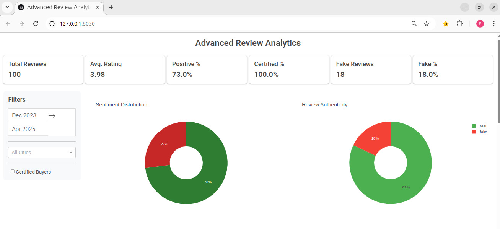
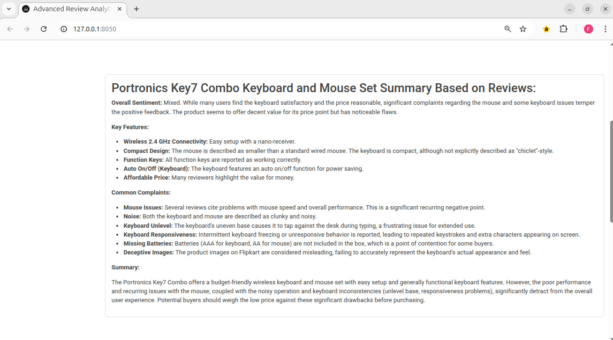
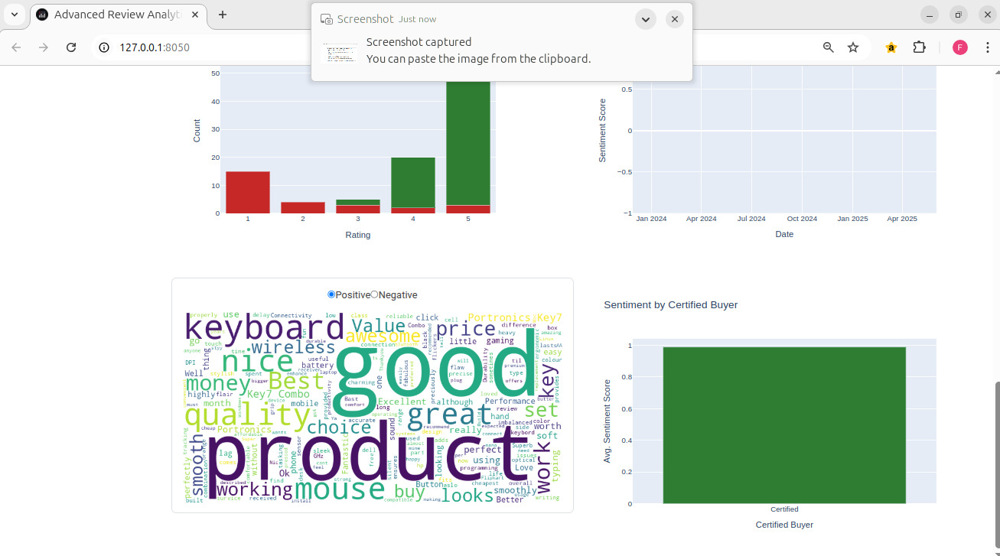

# Customer Review Data Analysis of E-commerce Using Apache Kafka and NLP

## Overview
A sophisticated data pipeline that analyzes e-commerce customer reviews using Apache Kafka streaming and Natural Language Processing. The system performs sentiment analysis, detects fake reviews, and presents insights through an interactive dashboard.

## Table of Contents
- [Features](#features)
- [Technology Stack](#technology-stack)
- [Project Architecture](#project-architecture)
- [Installation](#installation)
- [Usage](#usage)
- [Results](#results)
- [Contributing](#contributing)
- [License](#license)

## Features
- 🔄 Real-time data streaming with Apache Kafka
- 📊 Interactive dashboard with Plotly and Dash
- 🤖 NLP-based sentiment analysis
- 🔍 Fake review detection
- 📈 Advanced data visualization
- 🕒 Time-series analysis
- 🎯 Product-specific insights

## Technology Stack
- **Data Processing**: Apache Kafka
- **Backend**: Python 3.10+
- **Frontend**: Dash, Plotly
- **NLP**: NLTK, Google Generative AI
- **Data Analysis**: Pandas, NumPy
- **Visualization**: Matplotlib, Seaborn
- **Web Scraping**: Apify

## Project Architecture
```
major-pro/
├── analysis.py          # Data analysis and visualization logic
├── consumer.py          # Kafka consumer implementation
├── dashboard.py         # Interactive web dashboard
├── producer.py                # Review scraper and Kafka producer
├── enriched_reviews.csv # Processed review data
├── flipkart_results.csv # Raw scraped reviews
└── requirements.txt     # Project dependencies
```

## Installation

### Prerequisites
- Python 3.10+
- Apache Kafka
- Git

### Setup Steps
1. **Clone the Repository**
   ```bash
   git clone https://github.com/your-username/major-pro.git
   cd major-pro
   ```

2. **Create Virtual Environment**
   ```bash
   python -m venv venv
   source venv/bin/activate  # For Linux/Mac
   ```

3. **Install Dependencies**
   ```bash
   pip install -r requirements.txt
   ```

4. **Configure Environment**
   - Set up `GEMINI_API_KEY` in dashboard.py
   - Configure Apify token in producer.py
   - Verify Kafka connection settings

## Usage

### 1. Start Data Collection
```bash
python producer.py
```

### 2. Process Reviews
```bash
python consumer.py
```

### 3. Launch Dashboard
```bash
python dashboard.py
```

### 4. Generate Analysis
```bash
python analysis.py
```

## Results

### Terminal

*Initial Execution Interface*

### Sentiment Analysis

*Distribution of customer sentiments across products*

### Review Summary

*Review summary of customer reviews*

### Visualizations

*Review summary of customer reviews*

## Key Findings
- Successfully processed 100 reviews
- Identified 18% potential fake reviews
- Identified 73% positive reviews
- Identified 3.98 average rating

## Contributing
1. Fork the repository
2. Create your feature branch (`git checkout -b feature/AmazingFeature`)
3. Commit changes (`git commit -m 'Add AmazingFeature'`)
4. Push to branch (`git push origin feature/AmazingFeature`)
5. Open a Pull Request

## License
This project is licensed under the MIT License - see the [LICENSE](LICENSE) file for details.

## Acknowledgments
- Flipkart for the review data source
- Apify for web scraping capabilities
- Google Generative AI for NLP support

## Contact
Your Name - [dadigenikhil@gmail.com](mailto:dadigenikhil@gmail.com)
Project Link: [https://github.com/NikhilDadige47/Customer-Review-Data-Analysis-of-E-commerce-using-Apache-Kafka-and-NLP](https://github.com/NikhilDadige47/Customer-Review-Data-Analysis-of-E-commerce-using-Apache-Kafka-and-NLP)
